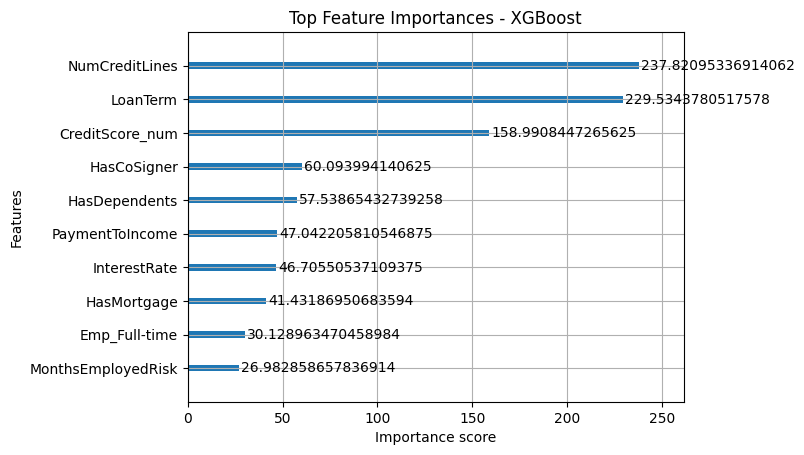

# 🚀 AI-Powered Loan Eligibility & Risk Scoring System  

This project implements a **machine learning system** to predict **loan default risk** using an **XGBoost model**, served via a **FastAPI backend**.  

It includes:  
- Data preprocessing  
- Feature engineering  
- Model training & evaluation  
- Visualizations to provide insights into loan risk factors  

👉 The system assists in loan eligibility decisions by generating a **risk score** for borrowers.  

---

## 📌 Project Overview  

- **🎯 Objective**: Predict the probability of loan default based on borrower features.  
- **🤖 Model**: XGBoost classifier with **SMOTE + RandomUnderSampler** for class imbalance.  
- **🛠️ Features**: 19 features (engineered ones like `IncomeRisk`, `CreditScoreRisk`, `PaymentToIncome`).  
- **⚡ API**: FastAPI endpoints for prediction (`/predict`) and model info (`/model_info`).  
- **📊 Visualizations**: Correlation heatmap, class imbalance, risk segmentation, precision-recall curve, and feature importance plots.  

---

## ⚙️ Setup  

### ✅ Prerequisites  
- Python **3.8+**  
- Git  
- Jupyter Notebook (Colab also works)  

---

### 🛠️ Installation  

```bash
# Clone the repository
git clone <your-repo-url>
cd loan-risk-scoring

# Install dependencies
pip install -r requirements.txt

## 🔗 API Endpoints  

###  POST `/predict` → Predict Loan Default Risk Score  

```json
# 📥 Input
{
  "Income": 55000,
  "LoanAmount": 12000,
  "CreditScore": 680,
  "MonthsEmployed": 24,
  "NumCreditLines": 2,
  "InterestRate": 7.0,
  "LoanTerm": 48,
  "DTIRatio": 0.4,
  "HasMortgage": "Yes",
  "HasCoSigner": "No",
  "HasDependents": "No",
  "Age": 28,
  "EmploymentType": "Full-time",
  "LoanPurpose": "Auto"
}

# 📤 Output
{
  "risk_score": 0.27
}


### GET `/model_info` → return model metrics

# 📤 Output
{
  "metrics": {
    "accuracy": 0.88,
    "roc_auc": 0.92,
    "confusion_matrix": [[60075, 7606], [5738, 3155]]
  },
  "features": [
    "IncomeRisk", "LoanAmount", "CreditScoreRisk", "MonthsEmployedRisk",
    "NumCreditLines", "InterestRate", "LoanTerm", "DTIRatio",
    "HasMortgage", "HasCoSigner", "AgeRisk", "HasDependents",
    "Emp_Full-time", "Emp_Self-employed", "Emp_Unemployed", "Emp_Part-time",
    "PaymentToIncome", "CreditScore_num", "EmploymentStabilityFlag"
  ],
  "feature_importance": {
    "IncomeRisk": 0.12,
    "LoanAmount": 0.08,
    "CreditScoreRisk": 0.15,
    "PaymentToIncome": 0.11,
    "CreditScore_num": 0.13,
    ...
  }
}
``` 

## 📊 Visualizations

Below are the visual outputs generated by the system:

### 🔥 Correlation Heatmap
Shows correlations between numerical features and the target (`Default`).


---

### ⚖️ Class Imbalance
Distribution of default (1) vs. non-default (0).


---

### 🏷 Risk Segmentation
Box plots of key risk-related features segmented by default status.


---

### 🎯 Precision-Recall Curve
Precision vs. recall trade-off for evaluating model performance.


---

### 🌟 Feature Importance
Top features contributing to loan default risk predictions.

